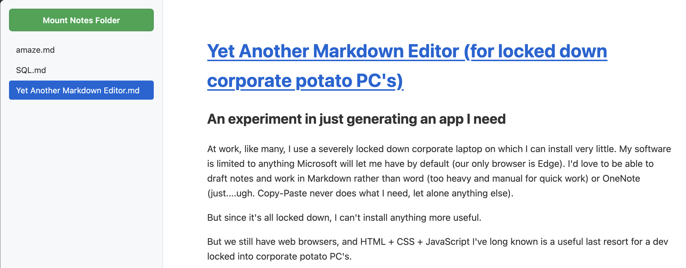

# [Yet Another Markdown Viewer (for locked down corporate potato PC's)](https://github.com/MartinChrisWood/really_simple_markdown_viewer)

## \[UPDATE\] And then, it became somewhat redundant

Turns out somewhat recently, [Microsoft added a Markdown editor to Sharepoint](https://office-watch.com/2026/markdown-editing-onedrive-sharepoint/).  It's still not quite what I need because it needs you to be online to work, and a critical requirement for my apps is "works on a train in a tunnel in the Peak District", but there you go.  One more option :)

## An experiment in just generating an app I need

At work, like many, I use a severely locked down corporate laptop on which I can install very little.  My software is limited to anything Microsoft will let me have by default (our only browser is Edge).  I'd love to be able to draft notes and work in Markdown rather than word (too heavy and manual for quick work) or OneNote (just....ugh.  Copy-Paste never does what I need, let alone anything else).

But since it's all locked down, I can't install anything more useful.

But we still have web browsers, and HTML + CSS + JavaScript I've long known is a useful last resort for a dev locked into corporate potato PC's.

There are various browser-based editors such as [StackEdit](https://stackedit.io/), which work pretty well and don't leak data out to the wider internet, running entirely client-side.  It's nice that so many before me had the same thoughts!  but a quick bit of experimentation proved I can't just save them locally from the browser and run them entirely inside an offline laptop (I catch trains through mountains, I need this).  I also suspect, but have not confirmed, that our aggressively stanced corporate web browsers would refuse to persist session or site information in such a way that I could not trust these apps to preserve my notes for any length of time.  I need the actual markdown files to be down, local, and backed up via the corporate overlord approved OneDrive.

## So I get to enter the "AI Era"

Previously, building an entire miniature web app just so that I could properly view markdown files quickly and locally would have been far too much of a faff.  I would have carried on with OneNote, and the gentle swearing that ensues each time copy-paste produces a bunch of useless source link info.

But now we have AI's to do mundane stuff for us, like coding up a little local web app in a single HTML file that I can then email to myself (because the only easy route for data to make it into a corporate environment is basically email).

For this project, I didn't even bother setting up properly for agentic coding, I was working in a coffee shop and my pet LLM is caged inside a chonky gaming desktop at home.  For a one-page app, having an argument with Gemini's chat interface and doing some copy-paste is more than enough.

## What's in there

### The core of it:  [marked.js by Christopher Jeffrey (MIT Licensed)](https://github.com/markedjs/marked)

The app Gemini gave me has two major components or aspects to it.  One of them is the markdown rendering library marked.js, which is essentially doing all the actual work!  Kudos to Chris and the 217 collaborators who've created this handy little doodad, suspect I'll find more uses for it as many others have.

I've downloaded a copy of [marked.min.js](https://cdn.jsdelivr.net/npm/marked/marked.min.js) to keep with my local app, so that nothing I do with this little app ever touches the internet.  People get touchy about the sensitivity of some of the corporate stuff, so better to be able to assert confidently that the internet isn't involved in any way.

### File access:  Folder input tag

The other major requirement is to be able to view and select files on the local hard disk. For obvious security reasons, a HTML page running in a browser isn't allowed to just access whatever random files on disk it likes.

Gemini called the folder input tag "old school", I like base HTML stuff, it will probably still be working a few years later.  Advantage:  Can easily add a button to select a folder to browse, of files to render.  Disadvantage:  Forgets it has permissions between sessions - a deliberate security conscious design decision by the internet people of yore.

### The editor:  Notepad.  Huh

I realised as I was building this that I didn't need a bespoke editor if I was just using local files, while syntax highlighting would have been nice, Notepad is perfectly capable of writing markdown, and is relatively minimal if you ignore the copilot button someone jammed in there against my will.

### viewer.html

I asked Gemini to keep everything bar `marked.min.js` in the same file, to simplify the transplant to my work PC, and sharing it with anyone curious.  Thus this file contains all the app's JS and CSS as well.  for that it's still only 160 lines long (on the first iteration).

## Some stretch goals/feature creep

It's an excellent MVP, some desirable features are:

1. Automatically refreshing the render, so that latest saved changes are viewable without manually clicking the file again (and without the browser returning to the top of the page)
2. Dark Mode.  Who doesn't want Dark Mode?

Both worked!  I tested it on this paragraph, it looks from a glance at the code that it's refreshing every 5s, and only if the file's actually changed.  I requested the light/dark mode be selected by polling the system's theme on the computer it's running on, rather than just being a toggle button.

## Result

It worked first time, every time!  In case you missed it in the title, here's the repo with the code:  [really_simple_markdown_viewer](https://github.com/MartinChrisWood/really_simple_markdown_viewer)

I've tentatively assigned it an MIT license in the hope that Gemini didn't rip off anything too important.  Weird world that I need to type such a sentence.  Once the folder picker input is directed to a set of files it happily lingers there, I edit the source file using whatever I like and the viewer catches up in at most five seconds.  There's probably a lot missing, no idea if marked.js can handle any weird maths or whether it handles code blocks for specific languages.  

But it's sufficient for me to eyeball markdown typed on my potato PC offline and locally, so that's me sorted.

## Critical weakness

The file browser on the left - it won't update if files are added or removed, it's not allowed to scan
for new files (see previous comments on security).  If I add or remove files, I have to re-mount the folder effectively.
This is annoying and involves three button presses, which is three more than I'd like, but workarounds don't really
seem to exist if I want to work with real files on a disk.
